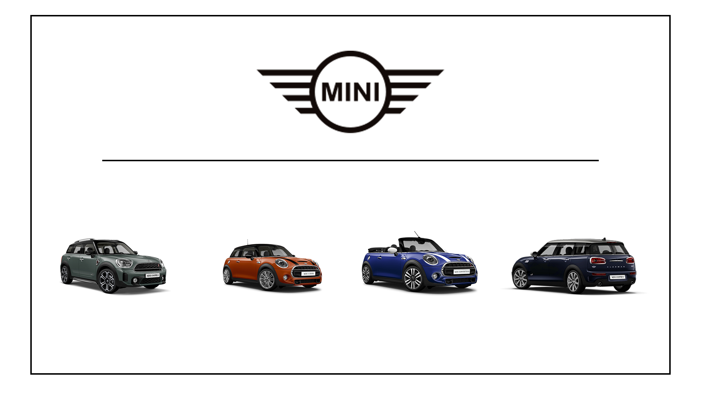

# Mini App

### Overview
This is an app that displays some Mini models and their corresponding data from a database. This was done using everything we have learned this semester, including SASS, VUE, AJAX, databases and Fetch.

### Getting Started
This is an HTML / SASS / js / PHP / AJAX / Vue / MySQL build.

To view the page, you will need to have WAMP or MAMP installed on your computer. Clone this to the root location in WAMP/MAMP and open it using the application. 

You can also view the source code by opening it in any code editing program of your choice, or clicking inspect in a chrome tab.

### Prerequisites
All you need to run this page is an up to date browser and WAMP/MAMP. The database can be found in the "includes" folder names "db_mini_app". The roadmap can also be found in the same folder under the name "Mini App Roadmap".

## Authors
1. Greg Avery - developer / designer
